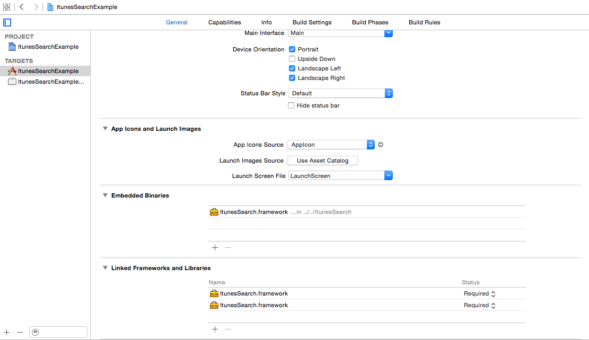

# ItunesSearch

This lib search in Swift Language help use Itunes Services, with this lib you can receive all information about track music from Itunes
You just need pass a term and the ItunesSearch return array with results.

# Used features
* Swift Programming Language

# CONFIG 

Download ItunesSearch.framework and add to your project.

After click in Project Blue Icon > in General search for Embedded Binaries when find expand and click + and Add too ItunesSearch.framework (this is step is important for your build).



# Example Sync Request

```
  import Foundation

  class ISRequestExample {

      init()
      {
         let results = ItunesSearch.SearchSync("metallica").results;
         
         if let artistName:String = results.first?.get(fromItem: ISItemKey.ARTIST_NAME)
         {
            println(artistName); //Metallica;
         }
         
         if let coverURL:String = results.first?.getCoverURL(ISCoverSize.REGULAR, dpi: ISCoverImageDPI.MEDIUM);
         {
            println(coverURL); //Dynamic URL from cover;
            
            // implement your way to load UIImage from URL;
         }
      }
  }

```

# Future
* Find by Kind, like App, or Music, or Video
* Search Async with delegate callback
